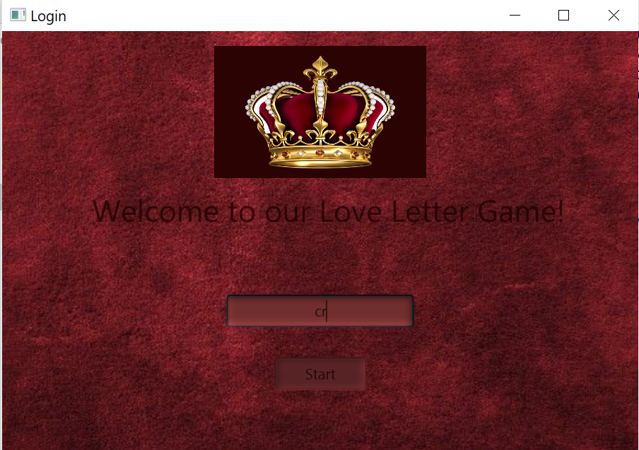
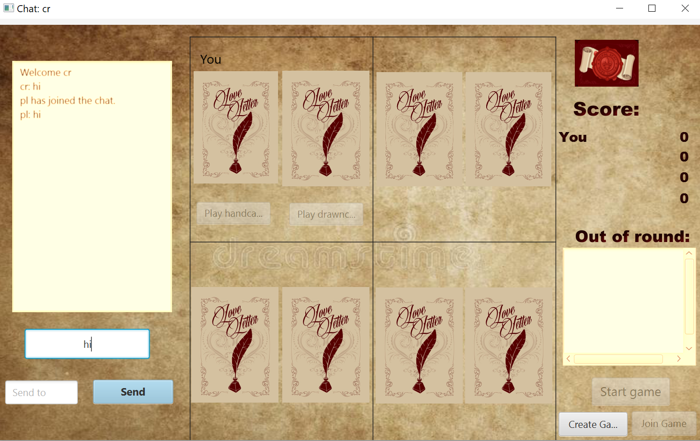

# Welcome to Love Letter!
This is our University project for the card game Love Letter.

To launch the game, run server.java first and then multiple client.java.

## The Game

Love Letter is a card game introduced in May 2012 and designed by Seiji Kanai. Each player aims to deliver a love letter to the Princess with the assistance of relatives and acquaintances. At the start of each round, one card is discarded face-down from the round, one card is dealt to each player and the rest are deposited face-down into a deck in the middle. During each player's turn, one card is drawn from the deck and the player gets to play either that card or the card already in their hand. After processing the effect described on the played card, the next player to the left gets a turn. This process is repeated until either the deck runs out, in which case the player holding the highest-value card wins the round, or all players but one are eliminated, in which case the remaining player wins the round. Once the round ends, the winning player receives a favor token. The game ends when one player has obtained a predetermined number of favor tokens, depending on how many players are participating.

For login, enter your name:

 

Then you can chat with other players via chat-box.

